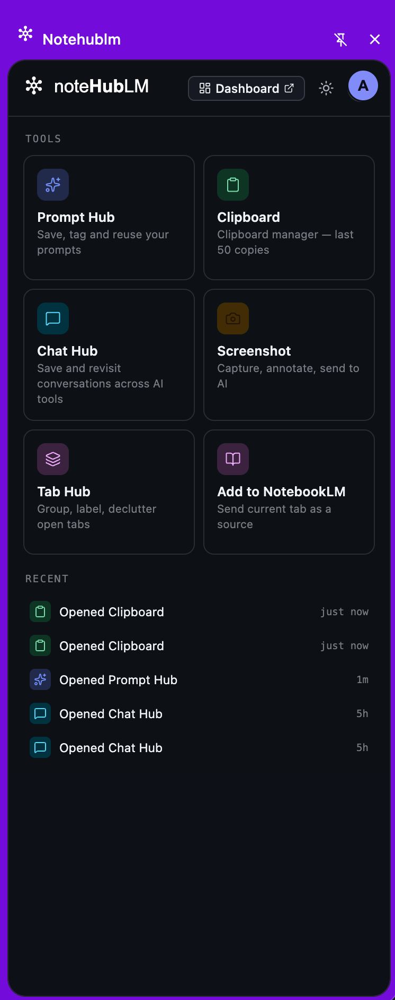
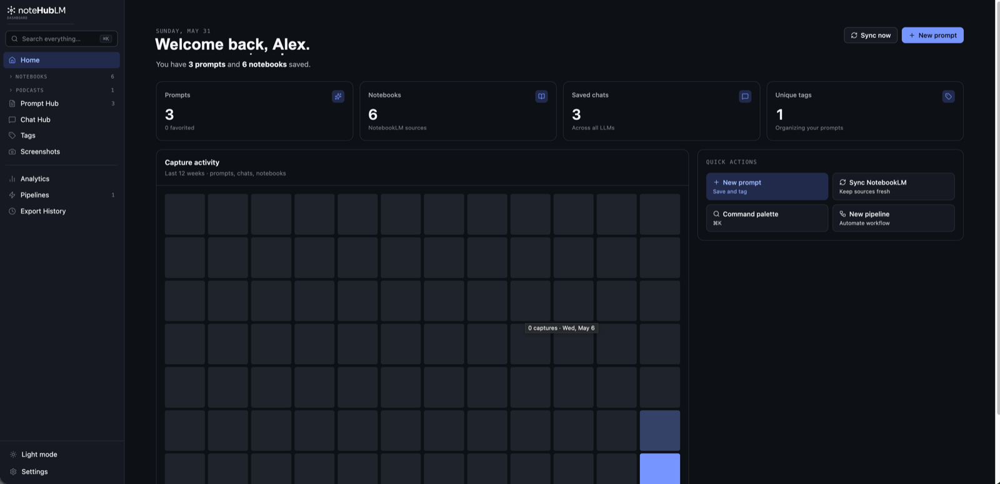
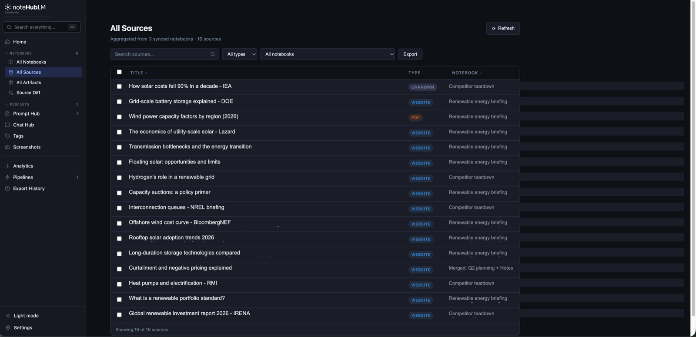
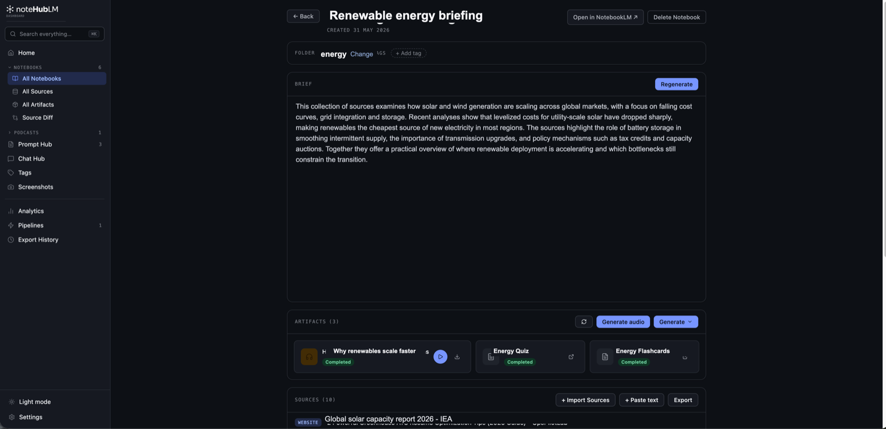
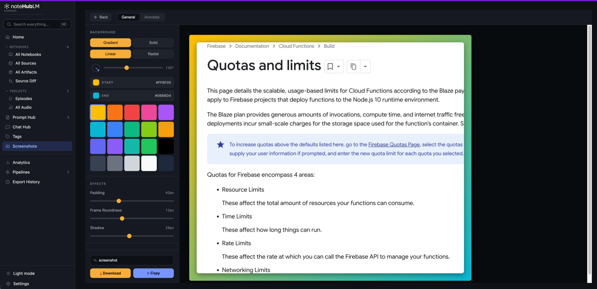
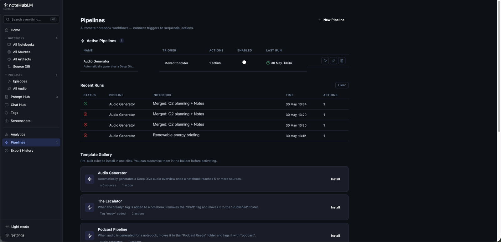
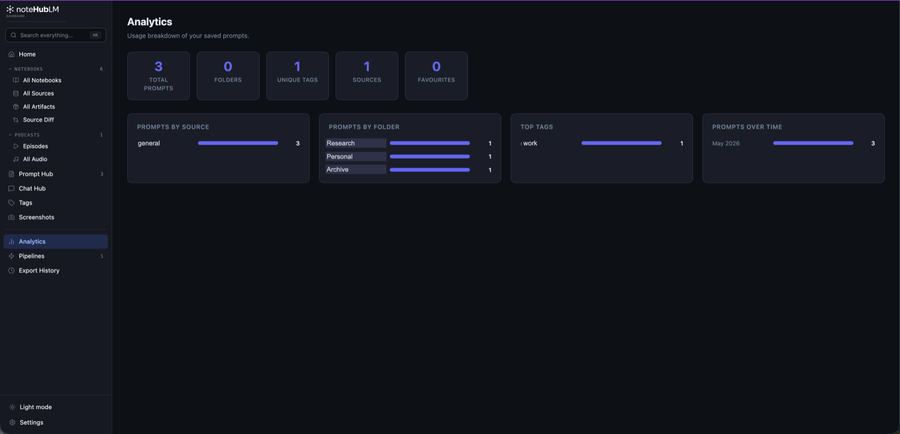

<div align="center">

# Notehublm

**A Chrome extension that supercharges NotebookLM — capture sources from anywhere, organize notebooks with folders and tags, and manage audio overviews.**

[](https://github.com/dkg42/notepad-extension/actions/workflows/ci.yml)
[](./LICENSE)
[](https://developer.chrome.com/docs/extensions/mv3/intro/)

[Website](https://www.notehublm.com) · [Architecture](./docs/ARCHITECTURE.md) · [Contributing](./CONTRIBUTING.md) · [Security](./SECURITY.md)

</div>

---

> [!IMPORTANT]
> This repository is **source-available, not open source**. You may read, audit, and build it locally for evaluation. You may not redistribute it or ship your own build. See [LICENSE](./LICENSE).

## What it does

NotebookLM is great at reasoning over sources you have already collected. Notehublm is about everything *around* that: getting sources in, keeping notebooks organized once there are dozens of them, and getting content back out.

### Capture

- **Save from any page** — select text anywhere on the web and send it straight to a notebook or to your snippet library.
- **Save from LLM chats** — export or capture conversations from ChatGPT, Claude, Gemini, Perplexity, Copilot, DeepSeek, Mistral, and Grok.
- **Bulk import** — pull in sources from a CSV file, an RSS feed, a website crawl, your open browser tabs, or pasted text.
- **Screenshots** — capture a region, annotate it, and attach it as a source.

### Organize

- **Folders and tags** for notebooks, with a tree view, bulk actions, and a command palette.
- **Notebook merge** and **source diff** to reconcile overlapping notebooks.
- **Pipelines** — rules that fire on triggers such as "source added" or "audio generated" and run follow-up actions automatically.
- **Domain router** — rules that decide which notebook a captured page lands in, based on its domain.

### Export & audio

- Export notebooks, sources, and chats as **Markdown, PDF, plain text, or Google Docs**.
- Browse, play, and download **audio overviews** and podcast episodes, with a persistent global player.
- **Analytics** and **export history** so you can see what you have collected over time.

### Sync

Your data lives in `chrome.storage.local` first, so the UI never blocks on the network. If you grant Drive access, it also syncs to your **Google Drive AppData folder** — a private, app-scoped area that is invisible in your Drive UI and not readable by other apps. Writes are debounced and queued; reads are cache-first.

## Screenshots

### Side panel — your tools, one keystroke away

Opens alongside any page. Prompt Hub, Clipboard, Chat Hub, Screenshot, Tab Hub,
and one-click "Add to NotebookLM" for the current tab.



### Dashboard — everything you have collected



### All Sources — every source across every notebook, in one table

Aggregated from your synced notebooks, filterable by type and notebook, and
exportable in bulk.



### Notebook detail



### Screenshot editor — capture, frame, annotate



### Pipelines — automate the repetitive parts



### Analytics



## Installing from source

You need **Node.js 20+** and a Chromium-based browser.

```bash
git clone https://github.com/dkg42/notepad-extension.git
cd notepad-extension
npm install                 # also runs `wxt prepare` via postinstall
cp .env.example .env.development.local
#   → fill in the values (see "Configuration" below)
npm run dev
```

Then load it into Chrome:

1. Open `chrome://extensions/` and enable **Developer mode**.
2. Click **Load unpacked**.
3. Select `.output-dev/chrome-mv3/` (dev) or `.output/chrome-mv3/` (production build).

Code changes hot-reload in dev mode. For the popup, close and reopen it.

## Configuration

Notehublm needs a Firebase project (for sign-in) and a Cloud Functions deployment (which proxies Google OAuth and billing). Neither is included in this repository — the backend is a separate, closed deployment.

Copy `.env.example` and fill it in:

| Variable | Required | What it is |
| --- | --- | --- |
| `VITE_FIREBASE_PROJECT_ID` | yes | Firebase project that signs the user in |
| `VITE_FIREBASE_API_KEY` | yes | Firebase Web API key (a public client identifier, [not a secret](https://firebase.google.com/docs/projects/api-keys)) |
| `VITE_FIREBASE_AUTH_DOMAIN` | yes | `<project-id>.firebaseapp.com` |
| `VITE_FIREBASE_STORAGE_BUCKET` | yes | Firebase Storage bucket |
| `VITE_FIREBASE_APP_ID` | no | Only used if App Check / Analytics is added |
| `VITE_FIREBASE_MESSAGING_SENDER_ID` | no | As above |
| `VITE_CLOUD_FUNCTIONS_BASE_URL` | yes | `https://us-central1-<project-id>.cloudfunctions.net` |
| `VITE_EXTERNAL_AUTH_ORIGIN` | yes | Origin of the hosted auth page loaded by the offscreen iframe |
| `VITE_ENABLE_GEMINI_NANO` | no | Feature flag, default `false` |

> [!WARNING]
> Never commit a filled-in env file. Only `.env.example` is tracked; `.env.development`, `.env.production`, and `.env.*.local` are all gitignored.

### Build profiles

Two modes, resolved from the `--mode` CLI flag in `wxt.config.ts`:

| | Dev | Production |
| --- | --- | --- |
| Env file | `.env.development[.local]` | `.env.production[.local]` |
| Output | `.output-dev/chrome-mv3/` | `.output/chrome-mv3/` |
| Command | `npm run dev` | `npm run build` |

Because output directories differ, both builds can be loaded into Chrome side by side without extension-ID collisions.

### Feature flags

Unfinished or unstable features are gated in `src/config/feature-flags.ts`. Each flag defaults **off** and is enabled per build profile via a `VITE_ENABLE_*` variable. Currently `geminiNano` gates "Enhance with AI" (Prompt Hub) and "Generate AI summary" (Tab Manager), both of which depend on a Chrome Prompt API setup that is not yet stable.

## Commands

```bash
npm run dev         # Dev profile + HMR  → .output-dev/chrome-mv3/
npm run build       # Production build   → .output/chrome-mv3/
npm run build:dev   # Dev-profile production build (no HMR), for smoke tests
npm run zip         # Production build + zip for Chrome Web Store submission
npm run typecheck   # tsc --noEmit
```

## Architecture at a glance

Built on [WXT](https://wxt.dev/) with React 18 and TypeScript. Four entry points — a **side panel**, a full-page **dashboard**, a **background** service worker, and an **offscreen** document that hosts the auth iframe — plus content scripts injected into supported sites.

```
src/
├── adapters/     Per-site DOM adapters (one file per LLM host) + registry
├── background/   Service-worker message handlers, split by domain
├── components/   React UI — dashboard/, sidebar/, shared/, ui/
├── content/      Content-script features (capture, panel enhancers)
├── entrypoints/  WXT entry points: background, content, dashboard, sidepanel, offscreen
├── export/       Export strategies (markdown, PDF, plain text, Google Docs) + registry
├── services/     Storage, auth, Drive sync, NotebookLM API, billing, pipelines
└── types/        Shared TypeScript types
```

Two patterns carry most of the extensibility:

- **Adapter pattern** — each supported site implements `ChatSiteAdapter`; `adapter-registry.ts` maps hostname → adapter. Adding a site is one new file plus one registry line.
- **Strategy pattern** — each export format implements `ExportStrategy`. Adding a format means adding a class, not editing existing ones.

Full detail, including data flow and the storage/sync model, is in [docs/ARCHITECTURE.md](./docs/ARCHITECTURE.md).

## Supported sites

| Site | Capture chats | NotebookLM enhancements |
| --- | --- | --- |
| notebooklm.google.com | — | Source panel search/filters, studio export |
| chatgpt.com, chat.openai.com | yes | — |
| claude.ai | yes | — |
| gemini.google.com | yes | — |
| www.perplexity.ai | yes | — |
| copilot.microsoft.com | yes | — |
| chat.deepseek.com | yes | — |
| chat.mistral.ai | yes | — |
| grok.com | yes | — |

Selection capture and the capture strip run on all URLs.

## Privacy & permissions

- **Your notebook content is never sent to a Notehublm server.** It stays in `chrome.storage.local` and, if you opt in, your own Google Drive AppData folder.
- The Cloud Functions backend sees only your Firebase identity and billing state. It holds the Dodo Payments API key server-side so it never reaches the client.
- `<all_urls>` host permission is required for selection capture and the capture strip, which must be able to run on any page you choose to save from.
- Drive scopes requested: `drive.appdata` (app-private sync) and `drive.file` (reserved for the Google Docs export feature).

## Known caveats

> [!NOTE]
> **NotebookLM has no public API.** `src/services/notebooklm-api.ts` talks to NotebookLM's internal `batchexecute` RPC endpoint using the signed-in user's own session. This is the only way to build these features today, and it means NotebookLM UI changes can break them without warning. If a NotebookLM feature stops working, that file and the adapters are the first place to look.

Likewise, each adapter's `findHeaderAnchor()` and `extractMessages()` target live DOM via CSS selectors. Chat sites redesign often — if one site breaks, check its adapter first.

## Contributing

Bug reports and pull requests are welcome. Please read [CONTRIBUTING.md](./CONTRIBUTING.md) first — it covers the component conventions (one folder per component, `.tsx` / `.css` / logic separation), naming rules, and what a good PR looks like.

To report a security issue, **do not open a public issue** — follow [SECURITY.md](./SECURITY.md).

## License

Source-available. Copyright © 2026 Deepak Krishnan. All rights reserved. See [LICENSE](./LICENSE).
